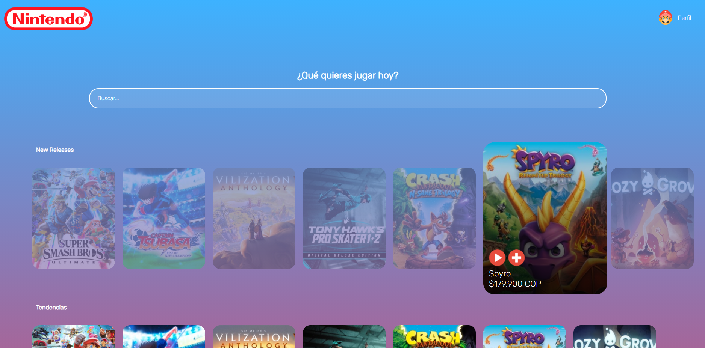
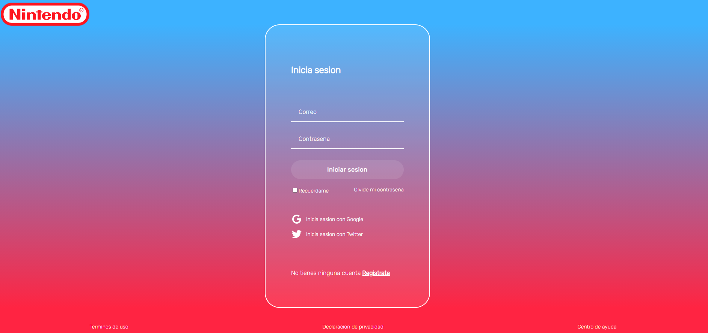
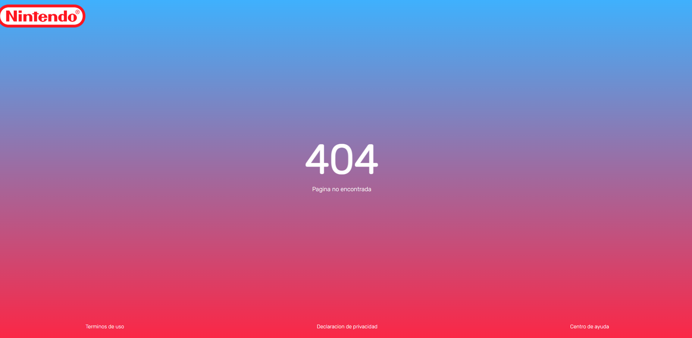

# Platzi_FrontendDeveloper2019
En el siguiente repositorio encontraras código adjunto del curso de platzi FrontendDeveloper2019 donde se plantean distintos retos y se maqueta una pagina web usando HTML Y CSS vainilla para dar estilos al front de la webpage. Diseñando el home, la pantalla de registro, el login y la pantalla de error de esta aplicación web dándole mi propio estilo convirtiéndola en una Nintendo eshop

## Usage

- en la parte de components podrás encontrar distintos archivos .html que basta abrirlos con un navegador para verlos
- en la carpeta styles estan listado todos los archivos con extension .css que son los que daran estilo a las paginas
- en la carpeta de img encontraras las distintas imagenes usadas en el proyecto

